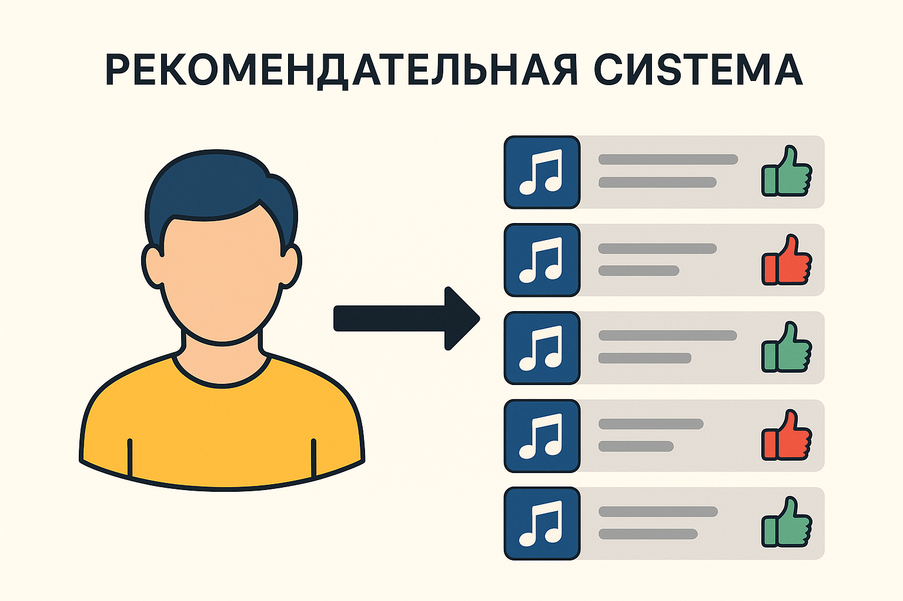
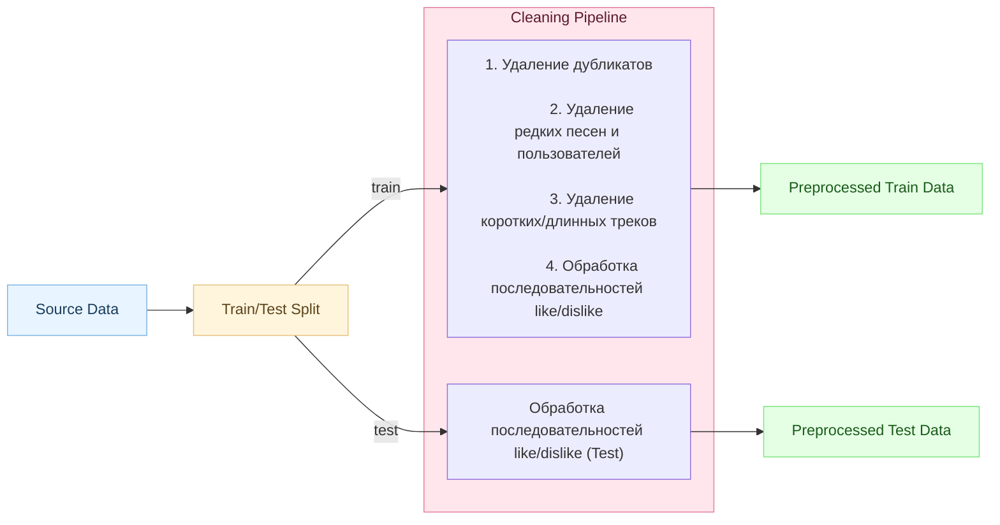
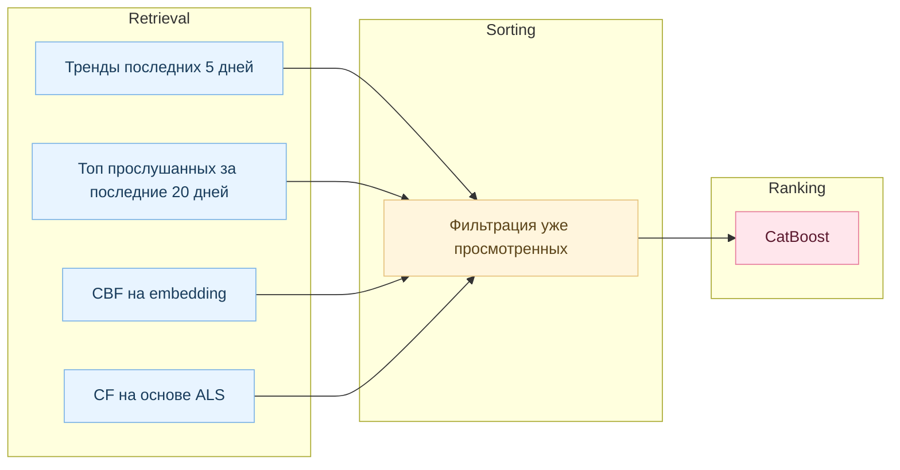
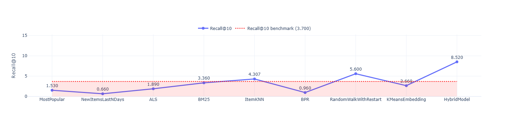
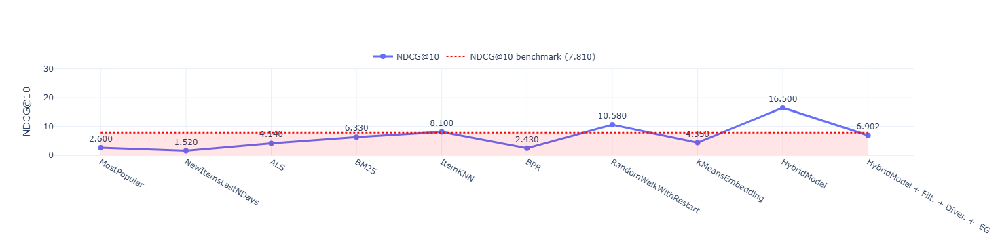

# recsys-pet-project

## Введение

Этот проект создан в рамках RnD-исследования, посвящённого изучению и практической реализации различных подходов к построению рекомендательных систем. Его цель — изучить, как современные алгоритмы рекомендаций могут определять интересы пользователя, анализировать его поведение и помогать ему открывать релевантный контент.

В проекте рассматривается полный цикл разработки рекомендаций:  
от подготовки данных и построения нескольких базовых моделей до обучения мета-ранжировщика, который объединяет сигналы разных алгоритмов в итоговый список рекомендаций. В планах финальная система должна быть развёрнута через API и демонстрировать, как может выглядеть прототип рекомендательного сервиса в реальных условиях.


### 🎯 Цели проекта

- **Изучить основные направления рекомендательных систем**  
  Понять, какие типы рекомендаций существуют (content-based, collaborative, sequence-based, hybrid) и в каких сценариях они применяются.

- **Разобраться с метриками качества и ключевыми алгоритмическими подходами**  
  Исследовать, как оценивают рекомендательные системы (Precision@k, Recall@k, MAP, NDCG, HitRate и др.) и какие алгоритмы лежат в их основе.

- **Построить базовый прототип и получить качественный бейзлайн**  
  Создать набор простых моделей и сравнить их, чтобы получить отправную точку для дальнейших проектов и улучшений.

- **Научиться работать с большими данными**

---

### 📌 Примечание

> **Этот проект — исследование, выполняемое полностью с нуля в RnD-формате.**  
> У меня нет заранее заданного вида конечного продукта, поэтому разработка идёт итеративно:  
> - сначала создаю простой, местами «грязный» код, чтобы понять механику алгоритмов и добиться рабочего результата;  
> - затем постепенно переписываю модули в более чистом и аккуратном виде;  
> - регулярно возвращаюсь к уже написанному и провожу рефакторинг.  
>
> В репозитории можно встретить черновые решения, временные конструкции, комментарии «для себя» и неидеальный стиль — это естественная часть исследовательского процесса.


## 🧠 Рекомендательная система

Рекомендательная система — это алгоритм, который помогает пользователю находить релевантный контент среди огромного количества доступных вариантов.  
Задача — сформировать такую подборку треков, из которой пользователю с высокой вероятностью что-то понравится.




### 🔍 X и Y

Как будет выглядеть набор данных: 

- **X** — набор признаков (features), описывающих пользователя, трек и их взаимодействие  
  (частота прослушиваний, тренды, контентные признаки, сигналы от разных моделей и т.д.).

- **Y** — целевая переменная (relevance):  
  список песен, которые пользователь *потенциально может послушать*


---

#### 📌 Примечание

> Формат Y менялся с улучшением системы. 
> Сначала цель была просто предсказать любое взаимодействие пользователя с произведением. 
> Затем задача усложнилась и нужно было предсказывать взаимодействие именно с новыми песнями, которые пользователь еще не слушал. При тестировании список прослушанных песен пользователя так же фильтровался от уже прослушанных, так как система не предсказывает такие песни и нет смысла учитывать их при тестировании. Пользователи которые не слушают новые песни не включаются в оценки (модель не может угадывать то, чего не было). Для учета таких случаев будет введена отдельная метрика, показывающая вовлеченность пользователей в рекомендательную систему.


!!! У Авторов не исключается из тестирования is_organic == 1 (ну либо я не нашла)


### Метрики

Для оценки таких моделей используются метрики ранжирования, которые показывают,
насколько хорошо топ-рекомендации совпадают с реальными интересами пользователей.

Наиболее распространённые из них — Precision@K, Recall@K и nDCG@K.
Они позволяют измерять точность, полноту и качество порядка в списке рекомендаций.

* Precision@K показывает, какая доля рекомендаций оказалась релевантной.
* Recall@K — какую часть всех релевантных объектов система сумела найти.
* nDCG@K — оценивает качество порядка, отдавая больший вес верхним позициям.

Precision и Recall просты, но не чувствительны к порядку;
nDCG сложнее, зато отражает реальное качество ранжирования.


Реализация метрик лежит в файле merics.py 


## 🧩 Dataset

### Chosen Dataset

For this project, we use the **YAMBDA (Yandex Music Big Data Analytics)** dataset —  
a large-scale, real-world dataset of user interactions from the **Yandex.Music** streaming platform.  
It is publicly available through [🤗 Hugging Face Datasets](https://huggingface.co/datasets/yandex/yambda) and contains millions of anonymized user–track events.

---

### Why This Dataset

The **YAMBDA** dataset was selected because it combines **realism, scale, and accessibility**, making it perfectly suited for research in recommendation systems and user modeling.

**Key reasons:**
- 📊 **Real user behavior:** based on genuine listening and “like” events from a real platform, not synthetic data.  
- 💾 **Large scale:** over **50 million** interactions, enabling testing of algorithms under realistic data loads.  
- 🕒 **Temporal data:** includes timestamps for each interaction, allowing time-based and session-aware modeling.  
- ⚙️ **Versatility:** suitable for both classical (ALS, collaborative filtering) and modern (deep learning) recommendation methods.  
- 🌍 **Open and reproducible:** available via Hugging Face for transparent, shareable experiments.

In short — YAMBDA offers both **data realism** and **industrial-scale complexity**, essential for evaluating recommender algorithms in practice.

---

### 📥 Data Loading

Изначально планировалось загружать данные напрямую через:

```python
pd.DataFrame(
    load_dataset(
        "yandex/yambda",
        data_dir="flat/50m",
        data_files="multi_event.parquet"
    )
)
```

Однако такой способ оказался слишком медленным — загрузка занимала значительное время и периодически зависала.  
Дополнительно стоит учитывать, что датасет в сыром виде весит **около 16 ГБ**, что делает загрузку через API HuggingFace особенно тяжёлой и нестабильной.

По этой причине датасет был скачан вручную с HuggingFace и обработан локально:

🔗 https://huggingface.co/datasets/yandex/yambda/tree/main/flat/50m

После загрузки файлы были открыты и обработаны стандартными средствами `pandas` и `pyarrow`.


### 📥 Data Preprocessing



- Обработка batch-ми
- 

#### Train/test split

Для начала разделим данные на обучающую и тестовую выборки. Деление выполняется по временному признаку, поскольку мы работаем с последовательностями действий пользователей.

Чтобы избежать data leakage — ситуации, когда признаки, рассчитанные на исторических данных, могут «заглядывать» в будущее — вводится временной зазор (gap) между обучающей и тестовой частями.

В оригинальной статье https://www.arxiv.org/pdf/2505.22238  используется соотношение 300 дней обучения, 30 минут gap, 1 день теста.

В моих экспериментах наилучшие результаты получились при конфигурации: 80 дней обучения, 30 минут gap, 20 дней теста.

Чтобы приблизиться к условиям статьи, я планирую снижать размер тестовой выборки, сохраняя возможность варьировать объём обучающей части как гиперпараметр модели. Такой подход позволяет гибко контролировать баланс между длиной обучающего периода и реалистичностью оценки качества.


### Очиска и кодирование данных 
Применим необходимую предобработку для очистки и подготовки данных. Подробные рассуждения о шагах и мотивации предобработки приведены в блокноте multi_event_preprocessing.
Все функции вынесены в отдельный модуль, что делает код более читаемым, модульным и удобным для повторного использования.

Кодируем uid и item_id в числовые индексы, чтобы модели и алгоритмы могли с ними работать.

Строковые ID нельзя напрямую подать в матрицу взаимодействий или Embedding-слой, поэтому мы переводим их в диапазон 0..N.
Это нужно для эффективности (память, скорость), совместимости с моделями (Matrix Factorization, Embeddings) и стабильного маппинга между train и test.


--------------------------------------------------------------------------------------------------
### Когда считаем, что песня понравилась пользователю  

В классическом виде предпочтения пользователя выражаются через **явные оценки** (explicit feedback):  
лайки, дизлайки, оценки от 1 до 5 и т.д.  
Однако в реальных данных таких оценок обычно **очень мало**, поэтому опираться только на них трудно.

Чтобы обойти эту проблему, преобразуем **неявное поведение** (implicit feedback) во что-то, что можно явно интерпретировать. В частности:

- считаем, что пользователю **нравится песня**, если он слушал её **минимум 5 раз**;
- одноразовые или редкие прослушивания считаем слабым интересом;
- пропуски, короткие прослушивания или отсутствие активности считаем низкой релевантностью.

Таким образом мы получаем более плотную выборку предпочтений, с которой можно обучать модели.

---

## Текущая схема системы 





## Эксперименты 

### 📊 Recall@10



### 📊 NDCG@10




## Выводы


Удалось превысить baseline - что уже хорошо
После екоторого ресерча выяснилось что низкая точность для

Это сложный сетап → нормальные значения будут:

✔ Recall@10: 0.05–0.12

✔ NDCG@10: 0.05–0.10

Причины:
* музыкальный каталог огромный (сотни тысяч треков)
* пользователь слушает мало из каталога
* длинный хвост → большинство треков прослушиваются 1–2 раза
* поведение людей очень разнообразно


## Копилка идей 
- добавить статус skip
- проверить retry прослушивания 
- обработать timestamp 
- ~~использовать информацию о альбомах~~
- Выстроить полноценный пайплан
- ~~новинки~~
- топ из похожих что уже слушали (топ артистов любимых)
- время суток, сезонность
- SASRec
- ~~Использовать все эмбединги юзеров~~
- ~~увеличить количество данных, с которыми работаю~~
- Exploration Ratio добавить как фичу и глобальную метрику
- использовать GNN


## ToDo
Почему выбраны именно такие метрики - объяснить
Описать алгоримты 

описать EDA (ембедингами, метаданные, основные данные)

про тест трейн сплит 

Про алгоритмы и что где реализованы (форма модели базовой вход выход)

В наличии методанные, которые можно использовать как фичи - попробуем - не получилось. Написать почему

Первые итерации с эмбедингами - очень низкая точность. Объеснить причины


Точность из result


