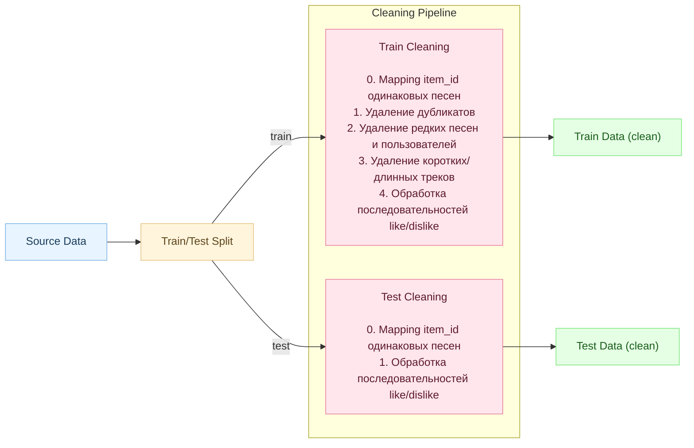
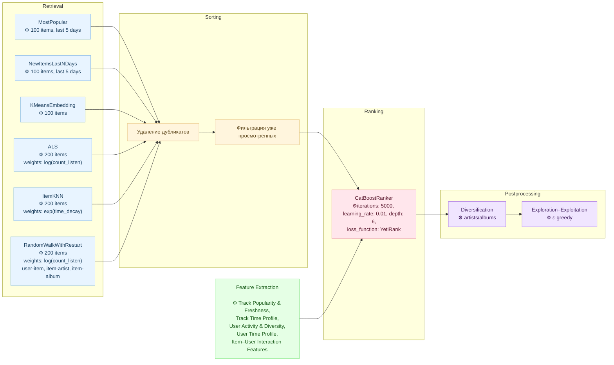

# recsys-pet-project

  
  
  
  
  
  
  
  
  
  
  
    
  
  

---

## О чем проект и зачем он нужен

Сегодня практически любой цифровой сервис — от VK и TikTok до Netflix и Spotify — живёт за счёт рекомендаций. Разделы вроде «Вам может понравиться» стали стандартом, а лента real-time-контента формируется полностью алгоритмами, анализирующими поведение пользователя.

Для человека это — способ быстро находить интересный контент среди бесконечного потока информации. Для бизнеса — мощный инструмент удержания и монетизации: хорошие рекомендации увеличивают время в сервисе, вовлечённость и конверсию.

Недавно Яндекс опубликовал крупный датасет для построения музыкальных рекомендаций — YAMaDa, основанный на реальных пользовательских логах и подробно описанный в исследовании. Это полноценный индустриальный датасет, созданный для развития и популяризации современных подходов к рекомендательным системам. 
   

Хорошие данные, высокая практическая актуальность и отсутствие прикладного опыта — идеальный сетап, чтобы изучить механики рекомендаций, построить качественные бейзлайны и получить опыт, максимально близкий к задачам реальных продуктов.

#### 📌 Примечание

> Проект выполнен в RnD-формате.  
> Работа ведётся итеративно: сначала быстрые прототипы, затем постепенная очистка и рефакторинг.  
> В репозитории могут встречаться черновые решения — это естественная часть исследовательского процесса.

## Что предсказываем и как будем оценивать (метрики, X-сы, Y-ки, data split) 

Цель рекомендательной системы — подобрать пользователю музыку, которая ему действительно понравится, опираясь на его прошлое поведение.
На входе у нас есть исторические данные (X), на выходе — список рекомендаций (Y).

### Train/test split 

Так как мы фактически пытаемся предсказать будущее по прошлому, разбиение данных должно учитывать время — поэтому используется time split. Чтобы избежать утечки данных (data leakage), между train и test добавляют временной зазор (gap). В оригинальной статье используется схема ниже. Так как планируется для banchmark брать результаты из исходой статьи - то будет использоваться такая же разбивка.

### X/Y

В теории для музыки в качестве признаков может подойти всё что угодно — вплоть до погоды и настроения пользователя. Но в рамках имеющегося датасета доступны следующие данные:
- История прослушиваний
- Реакции пользователя (`like` / `dislike`)  
- Эмбеддинги треков
- Мета-информация о треках (альбом, артист, длина трека)

Этого достаточно, чтобы построить базовую модель рекомендаций.

С Y немного сложнее.
По сути, Y — это список треков, которые пользователь *потенциально может послушать*.
Мы делим данные на train и test, и хотим научиться формировать список треков, который будет максимально близок к тому, что пользователь реально слушал в тестовый период.

Но есть нюансы:

#### 1. Органические vs рекомендованные прослушивания
Так как мы хотим сделать рекомендательную систему, а не просто предсказывать, что послушает пользователь, то нужно сравнивать именно с тем, что пользователь послушал из рекомендаций. В датасете авторы добавили колонку is_organic, которая показывает, откуда пользователь пришёл к треку. К сожалению, в исходном коде я не нашла, где они исключают органически прослушанные песни: либо я что-то пропустила, либо они действительно этого не делают. Поэтому метрики будут считаться в двух вариантах — с исключением органики и без.

#### 2. Исключая органику, мы фактически "предсказываем Яндекс"
Если брать за ground truth только рекомендованные системой треки, то мы просто моделируем рекомендации Яндекса — во-первых, это странно, во-вторых, в разрезе одного пользователя в режиме R&D практически невозможно.

#### 3. Нельзя проверить, «понравился бы» трек пользователю
Так как датасет статичный, мы не можем получить обратную связь в реальном времени.  
Поэтому вводится дополнительная метрика — **cosine similarity эмбеддингов** рекомендованных мной треков и реально прослушанных.

#### 4. Что считать «прослушано»/«понравилось»

В классическом виде предпочтения пользователя выражаются через **явные оценки** (explicit feedback): лайки, дизлайки, оценки от 1 до 5 и т.д. Однако в реальных данных таких оценок обычно **очень мало**, поэтому опираться только на них трудно.Чтобы обойти эту проблему, преобразуем **неявное поведение** (implicit feedback) во что-то, что можно явно интерпретировать. Как и авторы датасета, считаю, что трек считается прослушанным, если пользователь слушал >50% длины.

### 📊 Метрики

Выбор метрик зависит от целей, которые мы преследуем. Ниже представлен список выбранных метрик и объяснение, почему именно они используются.

| Название метрики | Зачем | Что измеряет | Формула |
|------------------|--------|--------------|---------|
| **Recall@K** | Важно предложить пользователю как можно больше релевантных треков, даже если среди рекомендаций окажутся «ошибки», пользователь всё равно сможет найти что-то подходящее. | Долю релевантных треков, найденных в топ-K рекомендаций | $Recall@K = \frac{\lvert Rel \cap Rec_K \rvert}{\lvert Rel \rvert}$ |
| **nDCG@K** | Критично удержать внимание пользователя с первых позиций, он не будет искать «бриллианты» внизу списка. | Качество ранжирования с учётом позиций | $DCG@K = \sum\_{i=1}^{K} \frac{rel_i}{\log\_2(i+1)}$ $IDCG@K = \sum\_{i=1}^{\lvert Rel\_K \rvert} \frac{1}{\log\_2(i+1)}$ $nDCG@K = \frac{DCG@K}{IDCG@K}$ |
| **Coverage** | Рекомендации должны быть разнообразными, а не состоять только из самых популярных треков. | Долю каталога, который система использует в рекомендациях | $Coverage = \frac{\lvert \bigcup\_{u \in Users} Rec\_K(u) \rvert}{\lvert Items \rvert}$ |
| **Cosine Similarity** | Так как датасет статичный и невозможно проверить, понравился бы трек пользователю в реальности, нужно сравнить, насколько рекомендованные треки похожи на реальные. | Близость эмбеддингов рекомендованных и прослушанных треков | $cosine\_similarity(A, B) = \frac{A \cdot B}{\lVert A \rVert \,\lVert B \rVert}$ |

### 📌 Краткое резюме

✔ Используется временное разбиение данных (300d / 30m / 1d)  
✔ X — прослушивания, реакции, метаданные, эмбеддинги  
✔ Y — треки, которые пользователь потенциально послушает  
✔ Метрики: Recall@K, nDCG@K, Coverage, cosine similarity  
✔ Отдельно сравниваем рекомендации с органикой и без неё

## 📥 Работа с данными 

### Data Loading
Датасет в сыром виде весит **около 16 ГБ**, что делает загрузку через API HuggingFace особенно тяжёлой и нестабильной. По этой причине датасет был скачан вручную с HuggingFace и обработан локально: 🔗 https://huggingface.co/datasets/yandex/yambda/tree/main/flat/50m 

Чтобы работать с данными без полной загрузки всего массива в память, используется библиотека Polars. Она поддерживает "ленивое выполнение", построчное сканирование Parquet-файлов, выборку только нужного числа строк и при этом обеспечивает высокую скорость и низкое потребление памяти благодаря реализации на Rust. Всё это позволяет эффективно обрабатывать большие датасеты, не превышая ограничений оперативной памяти.

### Data cleaning 
Для построения корректных рекомендаций необходима тщательная очистка данных. Подробные рассуждения, мотивация и промежуточные эксперименты представлены в блокноте notebooks/data_EDA. Ниже приведена краткая сводка ключевых этапов предобработки и причин их применения. 

| Шаг                                             | Где применяется                | Описание                                                                                           |
| ----------------------------------------------- | ------------------------------ | -------------------------------------------------------------------------------------------------- |
| **1. Обработка лайков и дизлайков**             | Train / Test отдельно          | Нормализуем последовательности реакций, оставляем последнюю корректную реакцию пользователя.       |
| **2. Фильтр по длине трека (60–300 сек)**       | Train                   | Удаляем слишком короткие и слишком длинные треки, чтобы не искажать обучение.                      |
| **3. Удаление одинаковых событий пользователя в один timestamp**         | Train          | Возможная аномалия, удаляем дубликаты                       |
| **4. Удаление редких треков**                   | Train                   | Треки с очень малым числом прослушиваний убираются как шумовые.                                    |
| **5. Удаление треков, отсутствующих в системе** | Train  | Из Train удаляем треки без embedding и метаданных; считаем метрику отдельно с ними и без них.      |
| **6. Удаление “редких” пользователей**          | Train                   | Пользователи с малым числом событий ухудшают обучение модели.                                      |
| **7. Mapping одинаковых песен по embeddings**          | Train / Test                   | Один и тот же трек может быть записан несколько раз под разными item_id                                      |

## Схема системы 

Текущая рекомендательная система устроена следующим образом.
Независимо друг от друга обучаются несколько компактных retrieval-моделей, каждая из которых предсказывает свой top-N список потенциально релевантных треков. Полученные списки объединяются, из них удаляются дубликаты, а также фильтруются треки, которые пользователь недавно слушал.

Далее для всех известных системе пользователей вычисляются дополнительные признаки. Эти фичи объединяются со score-ами retrieval-моделей и подаются на вход ранжирующей модели. Ранжирующая модель формирует итоговый упорядоченный список рекомендаций, расставляя треки по степени ожидаемой привлекательности.

Последним этапом является пост-обработка списка: удаляются треки с одинаковыми артистами и альбомами — для каждого сохраняется только самый высокий в ранжировании вариант. После этого в выдачу могут намеренно подмешиваться несколько разнообразных треков. Такой шаг помогает избежать однообразия рекомендаций и реализует элемент exploration в рамках дилеммы exploration–exploitation: система не только опирается на наиболее вероятные предпочтения пользователя, но и даёт ему возможность открыть что-то новое.

#### 📌 Примечание

> Схема отображает конфигурацию, которая дала лучший результат. В процессе экспериментов тестировались и другие модели. Подробней про модели ниже.

### Эвристические модели (Rule-based / Popularity-based)

**MostPopular**. Модель, выбирающая на основе статистики N самых популярных треков по статистике.  Статистика строится на основе явной обратной связи — лайков. Поскольку тренды меняются быстро, временное окно должно быть коротким, чтобы отражать актуальные предпочтения пользователей. 

**NewItemsLastNDays**. Модель, предлагающая N самых популярных треков, появившихся за последние дни.  Аналогична модели MostPopular, но учитывает только новые релизы. Это защищает от ситуации, когда в топах оказываются старые «вечные хиты» вроде «3 сентября» Шуфутинского.    

**LastListenRecommender**. Эвристическая модель, предлагающая треки, которые пользователь слушал ранее.  Даёт высокую точность, так как пользователи часто переслушивают недавние треки. Однако плохо подходит для рекомендаций, цель которых — предлагать новое. В будущих версиях подобные треки можно будет исключать или снижать их влияние.  

### Collaborative filtering

Collaborative Filtering (CF) — это подход к рекомендациям, который определяет предпочтения пользователя на основе поведения других пользователей со схожими паттернами взаимодействий. CF не использует содержимое объектов (музыка, текст, метаданные), а опирается исключительно на коллективные данные: что пользователи слушают, лайкают или просматривают.

**AlternatingLeastSquares (ALS)**. Модель матричной факторизации для неявных откликов (implicit feedback). Она раскладывает матрицу взаимодействий пользователей и объектов на две матрицы эмбеддингов — пользователей и айтемов — так, чтобы их скалярное произведение предсказывало интерес. Более подробно тут: https://education.yandex.ru/handbook/ml/article/rekomendacii-na-osnove-matrichnyh-razlozhenij. Для обучения ALS необходимо представить данные в виде матрицы взаимодействий, где каждая ячейка отражает степень интереса пользователя к треку. В рамках проекта в качестве веса использовалось логарифмированное число прослушиваний — это позволяет сгладить влияние пользователей, которые «зависают» на одной песне и тем самым искажают распределение интересов. Метод ALS работает только с пользователями и объектами, которые присутствовали в обучающей выборке. Если в тесте встречается пользователь, которого модель ранее не видела, для него невозможно построить профиль в факторизационном пространстве.

**BPR**.  Матричная факторизация, оптимизирующая ранжирование вместо предсказания численных оценок. Обучается так, чтобы вероятность «нравится айтем A больше, чем B» была максимальной. Особенно эффективна для неявного фидбэка.

**ItemKNN**. Модель, основанная на поиске соседей среди айтемов. Для каждого трека находятся наиболее похожие по поведению пользователей другие треки, и рекомендации формируются на основе этих похожих айтемов. Простая и эффективная модель, хорошо работающая на плотных взаимодействиях.

**BM25**. Алгоритм, изначально применяемый в информационном поиске. Рассчитывает релевантность айтемов пользователю на основе частоты взаимодействий и их распределения по датасету. Учитывает как количество взаимодействий, так и «редкость» айтема, что делает рекомендации более точными.

**RandomWalkWithRestart**.  Графовая модель, выполняющая случайные блуждания по графу пользователь–айтем с периодическим возвратом к исходному пользователю. В результате формируется распределение наиболее «близких» треков в графе, что позволяет выявлять скрытые связи и рекомендации, недоступные линейным моделям. Поскольку доступны метаданные об артистах и альбомах, граф был дополнительно расширен этими сущностями, что позволило повысить связность и выразительность представления данных.

### Кластеризация / эмбеддинги (Representation-based)

**KMeansEmbedding**       

Модель рекомендаций на основе эмбеддингов ищет треки, максимально похожие на те, что пользователь слушал сам (только органические прослушивания). Недавние треки имеют больший вес благодаря экспоненциальному затуханию.

#### Формирование профиля пользователя
Профиль строится не как средний вектор, а как набор центров кластеров последних прослушиваний. Это позволяет избежать «усреднения жанров», когда пользователь, например, слушает и рэп, и классику.

Для кластеризации используется spherical mean Shift. Обычный k-means требует заранее задавать число кластеров, а угадать, сколько разных жанров пользователь слушал в последнее время, довольно сложно. DBSCAN хорошо работает со сложными формами кластеров, но в данном случае нам нужны именно плотные компактные группы векторов. Если пытаться учитывать сложные формы (что полезно для выделения глобальных жанров), то можно получить центры, лежащие слишком далеко или даже в «чужом» кластере. (Для визуализации использовался umap)

 

На графике крестиком показано, где бы приблизитльно был бы профильный вектор пользовтеля, если бы мы брали среднее по всем векторам. Наиболее оптимальным подходом будет сначала кластеризовать, брать по каждой группе свой вектор и уже отталкиваясь от него искать похожие песни.

#### Поиск ближайших соседей

Точный поиск kNN требует вычислять расстояние до всех треков и работает со сложностью O(N), что слишком медленно на сотнях тысяч объектов. Поэтому используется ANN-поиск в Faiss, который строит индекс и позволяет находить ближайших соседей, обходя лишь малую часть точек. Это ускоряет поиск в десятки–сотни раз при минимальной потере качества и делает Faiss практическим стандартом для работы с большими коллекциями эмбеддингов.

### Ранжирование

Модель ранжирования нужна для того, чтобы из множества кандидатов, полученных от разных retrieval-моделей, выбрать действительно наиболее релевантные треки. Сами retrieval-модели дают лишь приблизительные скоры, которые не сопоставимы между собой, поэтому на этапе ранжирования эти скоры объединяются с фичами пользователя, трека и контекста, после чего формируется единый итоговый порядок рекомендаций. В качестве ранжирующей модели выбран CatBoostRanker, поскольку он стабильно показывает высокое качество, поддерживает современные loss-функции для Learning to Rank и эффективно работает с категориальными признаками без дополнительной обработки, что делает его удобным и надёжным выбором для гибридной рекомендательной системы.

#### Список features

| Type | Features |
|--------|-------------|
| Track Popularity & Freshness | `item_plays_last_5d`, `item_plays_last_30d`, `item_age_days`, `item_trend` |
| Track Time Profile | `item_plays_for_time_profile`, `item_morning_share`, `item_day_share`, `item_evening_share`, `item_night_share`, `item_weekday_share`, `item_weekend_share`, `item_avg_listen_hour`, `item_avg_listen_weekday` |
| User Activity & Diversity | `user_total_plays`, `user_active_days`, `user_unique_tracks`, `median_daily_plays`, `unique_tracks_share`, `days_since_last_play` |
| User Time Profile | `user_plays_for_time_profile`, `morning_share`, `day_share`, `evening_share`, `night_share`, `weekday_share`, `weekend_share`, `avg_listen_hour`, `avg_listen_weekday` |
| Item–User Interaction Features | `ui_days_since_last_play`, `artist_listen_count`, `album_listen_count` |

#### Эксперименты 

#### 📊 Recall@10

#### 📊 NDCG@10

## Выводы

Удалось превысить baseline - что уже хорошо
После екоторого ресерча выяснилось что низкая точность для

Это сложный сетап → нормальные значения будут:

✔ Recall@10: 0.05–0.12

✔ NDCG@10: 0.05–0.10

Причины:
* музыкальный каталог огромный (сотни тысяч треков)
* пользователь слушает мало из каталога
* длинный хвост → большинство треков прослушиваются 1–2 раза
* поведение людей очень разнообразно

## Копилка идей 
- добавить статус skip
- проверить retry прослушивания 
- обработать timestamp 
- ~~использовать информацию о альбомах~~
- Выстроить полноценный пайплан
- ~~новинки~~
- топ из похожих что уже слушали (топ артистов любимых)
- время суток, сезонность
- SASRec
- ~~Использовать все эмбединги юзеров~~
- ~~увеличить количество данных, с которыми работаю~~
- Exploration Ratio добавить как фичу и глобальную метрику
- использовать GNN

## ToDo
Почему выбраны именно такие метрики - объяснить
Описать алгоримты 

описать EDA (ембедингами, метаданные, основные данные)

про тест трейн сплит 

Про алгоритмы и что где реализованы (форма модели базовой вход выход)

В наличии методанные, которые можно использовать как фичи - попробуем - не получилось. Написать почему

Первые итерации с эмбедингами - очень низкая точность. Объеснить причины

Точность из result

